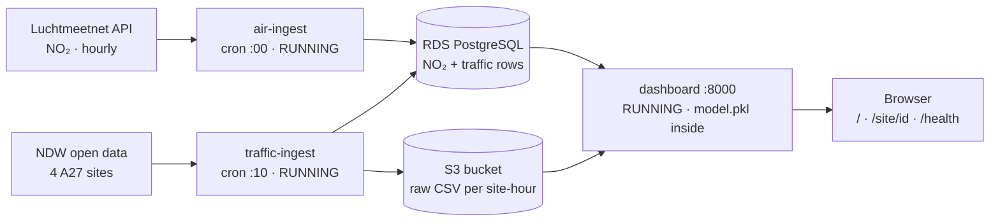

# Airbreda-Project
This repository contains the development and documentation of AirBreda, an AWS-based cloud data platform. It includes live RIVM and NDW data ingestion, PostgreSQL and S3 storage, machine learning experiments, a FastAPI dashboard, automated tests, and the architectural decisions behind the system.

<a class="btn" href="http://18.203.87.168:8000">Live dashboard</a>
<a class="btn" href="https://github.com/RakshithaAshok241195/Airbreda-Project">GitHub repository</a>
<a class="btn" href="Architecture_Design_doc.md">Architecture Design Document</a>

[Overview](#overview)  
[Research question](#research-question)  
[Architecture](#architecture)  
[Data pipeline](#data-pipeline)  
[Machine learning](#machine-learning)  
[Live system](#live-system)  
[Results & evidence](#results--evidence)  
[Learning & decisions](#learning--decisions)  
[The GitHub project](#the-github-project)

---

## Overview

AirBreda is a proof of concept I built for the *System Design & Cloud Platforms* elective at Breda University of Applied Sciences. Every hour it collects air-quality and traffic data, stores it in AWS, trains a regression model on it, and shows the result on a live dashboard.

| Area | Tools |
|------|-------|
| Cloud | AWS EC2, RDS PostgreSQL, S3, IAM (eu-west-1) |
| Containers | Docker, Docker Compose, cron |
| Backend | Python, FastAPI |
| Machine learning | scikit-learn |
| Quality | pytest (86 tests), structured JSON logging |

**In short:** the pipeline runs on its own in the cloud and serves real data; the model works, but six hours of overlapping data are not yet enough to predict NO₂ better than a simple average.

---

## Research question

> **Does traffic congestion at the A27 interchange near Breda cause nearby NO₂ exceedances?**

- **RIVM Luchtmeetnet** hourly NO₂ at station NL10240 (Breda-Tilburgseweg)
- **NDW** vehicles per hour and speed, per lane, at four A27 sites: both mainline directions and both slip roads

The two sources behave in opposite ways: if an hour is missed, Luchtmeetnet gives it back on the next request, but NDW traffic is lost for good. That difference shaped most of the design.

**Scope:** a proof of concept on one virtual machine, with a model trained on very little data not a production system.

---

## Architecture

- **One EC2 virtual machine** (using `t3.micro` as I learnt) runs three Docker containers: two ingestion jobs started by cron every hour, and the dashboard
- **RDS PostgreSQL** stores the readings; **S3** keeps the raw traffic files
- An **IAM role** gives the VM access to S3 without stored keys

**Key design decisions:** writes that can safely be repeated; the database written before anything else; the simplest compute that fits; the exact Docker image tested locally is the one deployed. The reasoning is in the [Architecture Design Document](Architecture_Design_doc.md).

---

## Data pipeline

- **Every hour at every hour** - NO₂ from Luchtmeetnet PostgreSQL
- **Every hour at every 10 min after the hour** - traffic from NDW PostgreSQL, plus one raw CSV per site S3
- **Bad data:** missing or stuck NO₂ values are **flagged and kept**; NDW `-1` values (no vehicle passed) are **logged and left out**

---

## Machine learning

Four simple linear models were trained on the 6 hours where both sources overlapped, and tested on hours they had not seen, against a baseline that always predicts the average.

| Model | Average error on unseen hours |
|-------|------------------------------|
| Baseline (always the average) | **6.74** µg/m³ |
| **Traffic only (deployed)** | **9.66** µg/m³ |
| Traffic + hour of day | 11.28 µg/m³ |

**Result:** no model beats the baseline yet, and live monitoring shows an error of 11.8 µg/m³ on new hours. NO₂ peaks in the morning and evening rush, which the model never saw in training, and it depends on weather it doesn't know about. The dashboard therefore shows the prediction as an experimental indicator.

---

## Live system

## Live system

"http://18.203.87.168:8000"> the live dashboard</a>

Every required endpoint, served by the FastAPI app on the EC2 VM. Each link opens the live response.

| Requirement | Live link |
|-------------|-----------|
| `GET /site/hrl` returns a real response | [http://18.203.87.168:8000/site/hrl](http://18.203.87.168:8000/site/hrl) |
| `GET /site/hrr` returns a real response | [http://18.203.87.168:8000/site/hrr](http://18.203.87.168:8000/site/hrr) |
| `GET /site/vwd` returns a real response | [http://18.203.87.168:8000/site/vwd](http://18.203.87.168:8000/site/vwd) |
| `GET /site/vwa` returns a real response | [http://18.203.87.168:8000/site/vwa](http://18.203.87.168:8000/site/vwa) |
| `GET /health` returns real timestamps for Luchtmeetnet and NDW | [http://18.203.87.168:8000/health](http://18.203.87.168:8000/health) |
| `GET /` shows the dashboard with real actual, predicted and traffic values | [http://18.203.87.168:8000/](http://18.203.87.168:8000/) |

Also available: [`/history`](http://18.203.87.168:8000/history) (the last 24 hours, measured vs predicted) and [`/model`](http://18.203.87.168:8000/model) (the model card).

*The system uses plain HTTP, so browsers may show "Not secure" in the address bar. HTTPS is listed as a next step*

---

## Results & evidence

**AWS deployment - the VM running the containers**

**The pipeline running**

)

**Docker the same image on my laptop**

**Tests and the live dashboard**

---

## Learning & decisions

- The hardest problems were in the environment, not the code: a missing settings file, an IAM role that was never attached, and a VM that ran out of memory all silent until I checked by hand
- Designing for data that can't be recovered matters more than designing for data that can
- A model has to be judged on data it hasn't seen, against a simple baseline

**Main decisions** six architecture decision records cover storage, messaging, resilience, compute, deployment and ML serving: see the [Architecture Design Document]([Architecture_Design_doc.md](https://github.com/RakshithaAshok241195/Airbreda-Project/blob/main/doc/Architecture_Design_doc.md)).

**Next steps:** Infrastructure as Code and CI/CD, monitoring with alerts, more data with weather features, and HTTPS.

---

## Future steps

AirBreda is a proof of concept. These are the steps I would take to turn it into a reliable system for the municipality, in order of priority.

**1. Automated, reproducible deployment**
- Describe the infrastructure (VM, security groups, IAM role, database) as code with Terraform, so the whole environment can be rebuilt in minutes
- Add a CI/CD pipeline that runs the tests, builds the Docker images and deploys them on every change, instead of copying files to the VM by hand

**2. Monitoring and alerts**
- Send the structured logs to CloudWatch and alert when `/health` reports stale data, so failures are noticed by the system instead of by me
- Add an external uptime check on the dashboard

**3. More data and a better model**
- Keep collecting for weeks, so the training data includes rush hours, nights and weekends
- Add weather features from KNMI (wind speed and direction, temperature), which affect NO₂ as much as traffic does
- Evaluate on later weeks than the model was trained on (a time-ordered split), and retrain regularly as data grows
- Only compare more complex models once the simple one beats the baseline

**4. Security**
- Remove the broad `AmazonS3FullAccess` policy, so only the scoped read/write policy remains
- Serve the dashboard over HTTPS, with a fixed (Elastic) IP address
- Restrict SSH access to known IP addresses

**5. Resilience and scale**
- Build the Warm Standby in a second AWS region, so a regional outage costs at most about one hour of traffic data
- At around 50 corridors, move ingestion to scheduled managed containers (ECS on Fargate) and run the dashboard on two instances behind a load balancer
- Also store the original NDW XML files, so past hours can be re-processed if a parsing bug is ever found

**6. Code structure**
- Reorganise the code into `ingestion/`, `ml/` and `app/` packages, retraining the model so it matches the new structure

---

## The GitHub project

<a class="btn" href="https://github.com/RakshithaAshok241195/Airbreda-Project">View the repository</a>

| Folder / file | Contains |
|---------------|----------|
| `[ingest_air.py](https://github.com/RakshithaAshok241195/Airbreda-Project/blob/main/ingest_air.py)`, `[ingest_traffic.py](https://github.com/RakshithaAshok241195/Airbreda-Project/blob/main/ingest_traffic.py)` | The two ingestion services |
| `[build_training_data.py](https://github.com/RakshithaAshok241195/Airbreda-Project/blob/main/build_training_data.py)`, `[train_model.py](https://github.com/RakshithaAshok241195/Airbreda-Project/blob/main/train_model.py)`, `[predict.py](https://github.com/RakshithaAshok241195/Airbreda-Project/blob/main/predict.py)` | Training data, model and prediction |
| `[dashboard.py](https://github.com/RakshithaAshok241195/Airbreda-Project/blob/main/dashboard.py)` | The FastAPI dashboard and API |
| `[Dockerfile](https://github.com/RakshithaAshok241195/Airbreda-Project/blob/main/Dockerfile)`, `[Dockerfile.traffic](https://github.com/RakshithaAshok241195/Airbreda-Project/blob/main/Dockerfile.traffic)`, `[Dockerfile.dashboard](https://github.com/RakshithaAshok241195/Airbreda-Project/blob/main/docker-compose.day4.yml)` | The three container |
| `[tests/](https://github.com/RakshithaAshok241195/Airbreda-Project/tree/main/tests)` | 86 pytest tested |
| `[docs/](https://github.com/RakshithaAshok241195/Airbreda-Project/tree/main/doc)` | Architecture Design Document |

