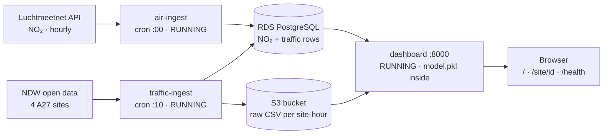
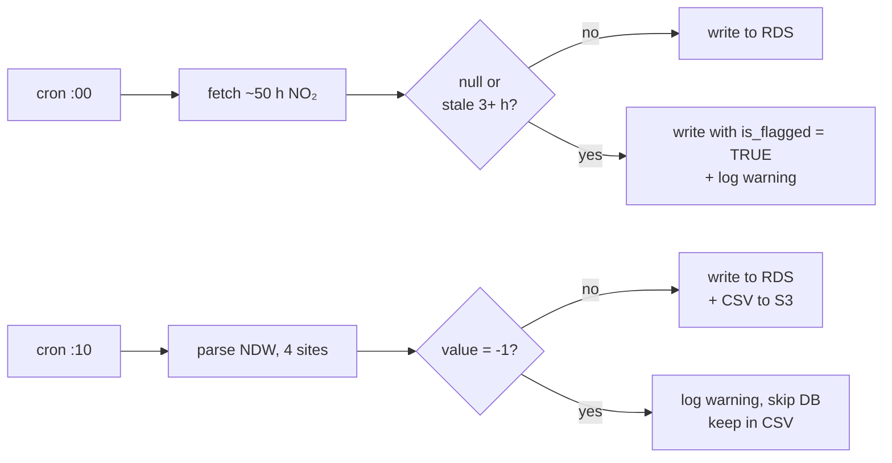
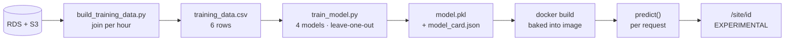
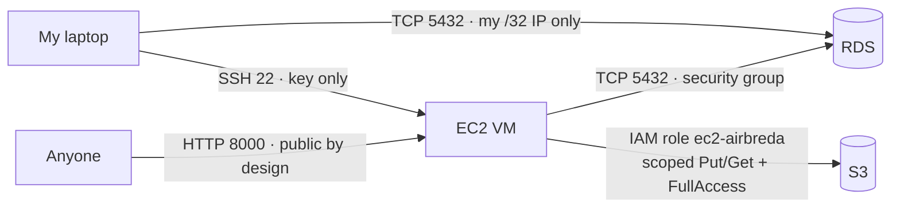

# AirBreda Architecture Design Document

System Design & Cloud Platforms (Elective)  
**Live system in VM**<http://18.203.87.168:8000>   
**Repository** <https://github.com/RakshithaAshok241195/Airbreda-Project> |

## 1. Introduction

### 1.1 The problem and the data

AirBreda is a proof of concept for the Municipality of Breda. It investigates whether traffic congestion at the A27 interchange contributes to nearby nitrogen dioxide (NO₂) exceedances. NO₂ is produced mainly by road traffic, it harms respiratory health, and it is regulated by EU limit values and WHO guidelines. The system combines two Dutch open-data sources:

#### **RIVM Luchtmeetnet** 
- Measures the NO2 as an hourly average, at station NL10240 (Breda-Tilburgseweg)  
- Has sites of only 1 station for the whole interchange  
- If an hour is missed it is recoverable as every request returns the last 50 hours 
- With an invalid data like null, or a value unchanged for three or more hours, which signals a station problem

#### **NDW open data**  
- Vehicles per hour and speed, per lane, at four sites
- The sites include `hrl`, `hrr` (A27 mainline, both directions) · `vwd` (entry slip road) · `vwa` (exit slip road)  
- If the hour is missed it is not recoverable 
- -1 on a lane, which means that no vehicle passed in that minute which is dropped and note used.

### 1.2 Why this is an architectural problem

Although the research question is analytical, the main challenge is architectural, and the model is the smallest part of it. Before a single prediction can be made, the system has to collect two sources continuously and without supervision, store them so that retries do not create duplicates, handle invalid values that mean something different in each source, align the sources in time, and present the result securely and affordably. A model is only as good as the pipeline that feeds it.

The most important property of the sources is their difference in recoverability. If the ingestion stops, Luchtmeetnet fills the gap itself on the next run, but NDW traffic is gone. This asymmetry shaped my decisions on storage, resilience and even the size of the training set.

---

## 2. Architecture as deployed

The system runs on a single EC2 virtual machine in AWS. Two one-shot ingestion containers are started by cron every hour, and one long-running dashboard container serves the web page and the API. Parsed readings are stored in RDS PostgreSQL, and raw traffic files in the S3 bucket `airbreda-rakshitha-raw`. The containers never call each other: they share data only through the database and the bucket, so any of them can fail, restart or be rebuilt without losing data.

**Components and data flows**

**Hourly ingestion and the two data-quality rules**

**Model lifecycle from stored data to served prediction**

**Network and accessibility**

- The dashboard API can be accessed by anyone. 
- The developer can acces it through the SSH key pair to the virtual machine.  
- Containers on the VM can be accessed through IAM role

### 2.1 Data-quality handling

- NO2 is null or stale, it is flagged as True into the data quality error logs. And not used for training.  
- NDW lane reports, snd not stored in the database. 
-1 one balues are raw in the S3 files, it is kept and counted in the CSV, but not used for training.  
- A missing NO2 hour, filled by the best run (50 hrs per call) used in training.  
- A missing traffic hour is lost because NDQ is live only, not used for training with all four sites are used.

Flagging keeps the record honest, because a gap would hide that something went wrong; excluding flagged values from training stops the model from learning from data that is known to be wrong.

### 2.2 Compute: understanding EC2 instance types

I understood that choosing a virtual machine on AWS means choosing an instance type. AWS organises instance types into families according to the resource a workload needs most, and each name encodes this. An instance type name such as `t3.micro` has three parts. It is used for this usecase because it is optimised for low average CPU with occassional bursts.  

For AirBreda this fits well. The machine is idle for most of the hour and only works for about a minute when the ingestion jobs run, while the dashboard serves very little traffic. A burstable instance therefore matches the workload better than an instance that pays for constant performance. Operating the system showed that memory, not CPU, is the binding constraint: 
- parsing the NDW feed exhausted the 1 GiB and froze the machine, which I resolved with 2 GB of swap. This determines how the instance should change as AirBreda grows. - At around ten corridors I would move to a `t3.small` (2 GiB) or `t3.medium` (4 GiB) the same family with more memory rather than to a compute-optimised `c` instance, because the bottleneck is memory. 
-The `t4g.micro` as I learnt would be about 20 % cheaper for the same size, but the container images would then have to be built for the ARM architecture.

---

## 3. Architecture Decision Records

### ADR-001 - Initial data storage strategy  

- AirBreda has relatively small, structured datasets from RIVM and NDW. The data needs to support time-based queries, hourly joins between NO₂ and traffic data, and repeated ingestion without creating duplicates. NDW data also needs separate protection because missed traffic data cannot be recovered later.
- I chose Amazon RDS for PostgreSQL for structured sensor readings and Amazon S3 for storing parsed NDW traffic data. PostgreSQL fits the required queries and joins, while S3 provides durable storage for traffic history.  
- I also considered using DynamoDB and using S3 as the only storage solution. This was not the perfect case for it as the project mainly requires SQL queries, time-based filtering and joins, which are more straightforward with PostgreSQL.  
This helped me understand that storage should be chosen based on how the data will actually be used, rathe rthan simply chosing the cheapest and most familiar option. I also learned that the difference beteen RIVM and NDW data recovery affects the architecture, not just the ingestion code. Testing repeated imports showed me why idempotency is important when working with scheduled data pipelines. 

### ADR-002 - Architecture   

- AirBreda has multiple data producers and may have multiple consumers in the future. I investigated how messaging could decouple these components while also handling repeated data and different data-quality issues between RIVM and NDW.  
- I used a Redis list as a local broker to test the messaging pattern because it was simple to run in Docker. I chose database first, queue second, so a broker failure would not result in lost readings. RIVM invalid or stale readings are flagged and kept, while NDW -1 values are logged and excluded from the database. For a future production setup with multiple consumers, I would use SNS to SQS rather than a single queue, with a Kappa-style processing approach.  
- I considered direct producer-to-consumer communication, SQS/Service Bus and a Lambda architecture. Direct communication would make the system harder to extend, while cloud messaging was unnecessary for the local experiment. Lambda would also introduce separate processing paths that could produce inconsistent results.  
This was where I started to understand that messaging is not just about moving data between services, but also about protecting data and controlling how failures are handled. Testing Redis showed me that at-least-once delivery can create duplicates, so consumers also need to be idempotent. I also learned that adding a broker does not automatically make an architecture better; after deploying the system, I realized that without a second consumer, Redis added complexity without providing much benefit.

### ADR-003 - Resilience strategy  

- AirBreda is an advisory system, so it does not require the same availability as a safety-critical system. I tested how the two data sources behave when data is missing and found that RIVM data can be recovered, while missed NDW traffic data is permanently lost.  
- I chose a 99.5% SLO and a future Warm Standby setup with an RTO of about 15 minutes and an RPO of about one hour. The RPO is mainly influenced by NDW because missed traffic data cannot be recovered. I rejected Active-Active because the additional cost and complexity did not fit the current use case.  
This helped me understand that resilience should be based on the actual impact of failure, rather than simply aiming for the highest possible availability. Testing the RIVM recovery also showed me that different data sources can require different resilience strategies. I also learned to distinguish between the architecture I recommend for the future and what is actually implemented in the current system.

### ADR-004 - Compute strategy (Day 3)

- The AirBreda workload is small and periodic. The ingestion jobs run once per hour, need access to RDS and S3, and should run without manual intervention. I therefore needed a simple and affordable way to move the locally tested containers to the cloud.
- I understood of why I chose EC2 t3.micro running the ingestion containers with cron. The air and traffic jobs are staggered by ten minutes to reduce memory pressure. AWS access is provided through an IAM role, while database configuration is provided through environment variables. I also removed Redis from the deployed system because there was no consumer that needed the messages.
Moving from my laptop to AWS showed me that a solution working locally does not mean it will work in the cloud. I encountered issues with missing envir configuration, an unattached IAM role and limited VM memory that I had not seen during local testing. Also about that deployment, permissions and infrastructure are part of the system itself, not something separate from the application.

### ADR-005 - Compute and deployment strategy 

- Adding a dashboard that needs to stay available while the two ingestion jobs continue running hourly. The workload is small, so I decided to keep the dashboard on the existing EC2 instance rather than introduce additional infrastructure.  
- I added the dashboard as a third Docker container on the same VM. Unlike the ingestion containers, it runs continuously with restart unless-stopped and docker starts automatically after a reboot. I tested the same Docker image locally against the real RDS and S3 before deploying it to the VM, with environment-specific configuration supplied separately.  
- I considered using a managed container service, but the current workload did not justify the additional infrastructure and cost.  
This was where I learned that testing the application locally and testing the deployed system are both necessary. Local testing helped me find issues such as slow S3 reads and repeated calculations, while the VM exposed different problems related to memory and AWS permissions. I also learned that deployment decisions are not only about whether something works, but also about how easy it is to maintain and recover.

### ADR-006 - ML serving architecture (Day 4)

  | Model | MAE on held-out hours (µg/m³) | R² on training hours |
  |-------|------------------------------|----------------------|
  | Baseline (training mean) | **6.74** | - |
  | **Traffic only (deployed)** | **9.66** | 0.27 |
  | Traffic + hour of day (course model) | 11.28 | 0.61 |
  | Ridge, traffic + hour of day | 11.43 | 0.00 |

- At Day 4, I had only six joined observations containing both traffic and NO₂ data. This made a normal train/test split unreliable, so I needed to be careful not to treat the model results as stronger evidence than the data supported.
- I evaluated the model using leave-one-out validation and compared it with a simple mean baseline. The deployed model uses total traffic as its main feature and is trained offline before being packaged into the dashboard Docker image. The prediction is treated as an experimental indicator, while measured NO₂ remains available if the model cannot produce a prediction.

---

## 4. Trade-offs

- **Storage:** I considered DynamoDB, object storage alone and a relational database. AirBreda produces about 96,000 rows per corridor per year, and its workloads are an indexed lookup (the latest reading) and a join (NO₂ with traffic per hour), so I chose RDS PostgreSQL for parsed readings and S3 for raw traffic files. The primary key made every write idempotent, which I verified when a repeated import created no duplicates. I gave up schemaless flexibility and effortless horizontal scaling, which I do not need even at ten stations over five years — an estimated 4.8 million rows, or about 0.5 GB.

- **Compute:** I considered a VM with cron, long-running Compose services on a VM, ECS on Fargate and Lambda. Because the ingestion jobs run for about one minute per hour, I chose one burstable `t3.micro` (about €7 per month) with one-shot containers, and added the dashboard as a third container rather than as a managed service, which would have cost an estimated €15–30 per month more. I gave up managed health-based replacement and scaling: the VM is a single point of failure that I operate myself, a cost that became visible when the NDW parse exhausted its 1 GiB of memory.

- **Messaging:** I considered direct database writes, a Redis list, Redis Streams and a managed topic. I implemented a Redis list with the database written first, so that a broker failure cannot lose data, and disabled it in the deployed system because no component consumes the messages; in production, an SNS topic fanning out to SQS queues would serve several consumers. I gave up the decoupling a broker provides for future consumers, and accepted at-least-once rather than exactly-once delivery the recovery test produced six duplicate messages, so consumers must be idempotent.

- **Recovery:** I considered Backup & Restore, Pilot Light, Warm Standby and Active-Active. Because NO₂ backfills about 50 hours while NDW traffic cannot be recovered, the recovery point for traffic was the deciding factor, so I set a 99.5 % SLO (216 minutes per month) and chose Warm Standby as the target, with an RPO of about one hour at roughly €23 per month; Active-Active would add about 25–30eu per month for availability the use case does not need. I gave up immediate protection the standby has not been built, so the deployed system is effectively Backup & Restore, and a failure today would mean downtime and lost traffic hours.

---

## 5. Cloud provider rationale - for the Municipality of Breda

- **What it gives us.** For basically every hour, the system collects air-quality measurements from the national monitoring network and traffic counts from the national road authority, stores them safely, and shows them on a web page anyone can open. AWS keeps the hardware running, makes automatic backups of the database, and allows us to start small and grow from one road junction to many without rebuilding everything. At normal prices the whole system costs less than about thirty euros a month, and during the trial it has cost nothing.

- **Why it suits a Dutch public organisation.** All data is stored in AWS's data centres in Ireland, inside the European Union, so it falls under European privacy law (the GDPR). The data itself is not personal: it consists of public measurements of air and traffic, not information about people. Access is strictly limited: only our own system and named developers can reach the database, and no passwords are stored in the program code.

- **What we would lose by switching.** Moving to another provider is possible, because AirBreda uses common building blocks a standard database and ordinary data files — rather than features that only AWS offers. A move would still cost time: setting everything up again, testing it, and checking security once more. If the municipality required its data to remain physically in the Netherlands, a provider with a Dutch data centre, such as Microsoft's in the Amsterdam region, would be a better fit, and our design would carry over with modest effort.

**Value** AWS gives the municipality a reliable, low-cost and secure home for public data within the EU, without binding it to one provider permanently.  

---

## 6. Cost estimate

AWS eu-west-1, on-demand list prices, per month:

| Component | Current (1 corridor) | At 10 corridors | At 50 corridors |
|-----------|---------------------|-----------------|-----------------|
| **Compute (VM)** | 11eu - `t3.micro`, 8 GB disk, public IPv4 | 19eu - `t3.small`, 20 GB, public IPv4 | 34eu - `t3.medium`, 30 GB, public IPv4 |
| **Database** | 17eu - `db.t4g.micro`, 20 GB, public IPv4 | 25eu - `db.t4g.small`, 20 GB | 56eu - `db.t4g.small` Multi-AZ, 50 GB |
| **Object storage** | 1eu | 7eu | 36eu ( 1eu with hourly caching) |
| **Total** | ** 29eu** | ** 51eu** | ** 126eu** |

- **Basis:** AWS Pricing Calculator (calculator.aws) and on-demand rates for eu-west-1, October 2026 EC2 `t3.micro` $0.0114/h, `t3.small` $0.0228/h, `t3.medium` $0.0456/h; RDS `db.t4g.micro` ≈ $0.018/h and `db.t4g.small` $0.036/h (doubled for Multi-AZ); public IPv4 $0.005/h per address; S3 $0.023 per GB-month, $0.005 per 1,000 PUT and $0.0004 per 1,000 GET requests; converted at approximately €0.86 per US$.
- **Actual spend: 0eu.** The account runs on AWS's free plan with $120 in credits, which would last about three and a half months at the estimated rate.
- **S3 cost is driven by requests, not storage.** The data itself stays small (about 10 MB of CSV files per corridor per year), but an open dashboard re-reads up to 28 objects per minute; caching the latest complete hour would reduce this by a factor of about 60.

**Is a single VM still the right choice?** At **10 corridors, yes**: a `t3.small` with 2 GiB of memory can run ingestion for 40 sites and the dashboard, provided the NDW feed is parsed once for all sites. At **50 corridors, no**: one machine would collect data for the entire municipality, so a single failure would stop all collection and break the 99.5 % SLO. Ingestion should then move to scheduled managed containers, and the dashboard to at least two instances behind a load balancer (about 20eu per month more).

---

## 7. Reflection

### 7.1 The decision I am least confident in

The decision I am least confident in for the long term is running all three containers on a single VM. It was the right choice for one corridor and costs about 7EU a month, but Day 4 showed me where its limits lie. Parsing the NDW feed exhausted the 1 GiB of memory and froze the machine, and while it was frozen, data collection and the dashboard failed together, without a single log line explaining why. Adding swap resolved the symptom, but I do not yet know how much headroom remains. To become confident, I would need to know how much memory and time each hourly run uses over several weeks, so I can tell whether swap is a safety margin or a crutch; how often runs fail and how long recovery takes, which would tell me whether 99.5 % is realistic on one machine; and how much downtime the municipality would actually accept. If the VM were regularly close to its limits, I would move to a larger instance in the same type of VM, or separate ingestion from the dashboard.

### 7.2 What a full year of data would change

The model is trained on six hours and does not outperform a constant prediction. The live dashboard shows why: at 21:00 the station measured 40.2 microgram/m while the model predicted 17.2, because still evening air traps emissions regardless of traffic volume. I have realised that a year of readings would change what is reasonable, not only how much data there is. The features would include weather (wind speed and direction, and temperature, from KNMI), a proper encoding of the time of day, weekday versus weekend, and lagged values such as the previous hour's NO₂ and traffic. The evaluation would change from leave-one-out to a time-ordered split, training on earlier months and testing on later ones, so that the model is never tested on hours adjacent to those it has seen. Only with that evaluation in place would a comparison with more flexible algorithms, such as gradient-boosted trees, be fair, and I would keep the linear model unless the alternative performed clearly better on unseen months.

### 7.3 The first production improvement

The first thing I would add is Infrastructure as Code with a CI/CD pipeline. Today, deployment depends on configuring the VM by hand, and almost every problem I encountered was an environmental difference that a person had to notice: a file that was not copied, a role that was not attached, memory that was insufficient. A municipal system should be reproducible, version-controlled and deployable without manual changes. With the VM, security groups, IAM role and database described in code, and a pipeline that runs the tests, builds the images and deploys them, the environment would become reviewable, could be created in minutes. Close behind are monitoring with alerts on `/health`, removing `AmazonS3FullAccess` so that least privilege takes effect, a fixed IP address, HTTPS, and SSH restricted to known addresses.

Choosing the instance type, for example, taught me to identify the binding resource of a workload before choosing hardware: for AirBreda that was memory, not CPU. Starting again, I would add log files to every scheduled job and verify the VM's identity and memory from the first deployment.

---

## 8. Conclusion

AirBreda demonstrates an end-to-end cloud architecture for collecting, storing, processing and presenting environmental and traffic data. The proof of concept integrates two external sources with different recoverability, idempotent storage in RDS and S3, scheduled ingestion with explicit data-quality handling, offline model training with served inference and live monitoring, and a dashboard and API all on a deliberately small and inexpensive AWS deployment.

The evaluation also shows that a working pipeline is not the same as a validated result. The model does not outperform a simple baseline, live monitoring shows an even larger error on new hours, and six overlapping training hours do not allow conclusions about the relationship between traffic and NO₂. AirBreda should therefore be understood as a functional and honestly evaluated proof of concept rather than a production-ready municipal platform. The decisions recorded here provide the foundation for the next step: continuous data collection, automated and reproducible deployment, monitoring, stronger model evaluation and greater resilience.

---

## References

- Amazon Web Services. *Amazon EC2 instance types* and *Burstable performance instances*. AWS documentation.  
https://aws.amazon.com/free/?trk=52605843-2998-4d6e-a9f7-390cbf6d2c3d&sc_channel=ps&ef_id=Cj0KCQjwz4LWBhCMARIsAFEG5Mq3KyIcVlmnsT_fk384LAOvpPibCMupkzQoWDLxaI45HY5v9b79GpQaAvoiEALw_wcB:G:s&gads_camp=23533256638&gads_ag=193057747335&gads_ad=795841353784&gads_kw=aws%20console&gads_matchtype=e&gads_network=g&gads_device=c&gads_geo=9194153&gad_campaignid=23533256638&gbraid=0AAAAADjHtp_RVzxCn1MqF0MXPgn5Ltn17&gclid=Cj0KCQjwz4LWBhCMARIsAFEG5Mq3KyIcVlmnsT_fk384LAOvpPibCMupkzQoWDLxaI45HY5v9b79GpQaAvoiEALw_wcB  

- Kleppmann, M. (2017). *Designing Data-Intensive Applications*. O'Reilly.  
https://martin.kleppmann.com/2015/05/11/please-stop-calling-databases-cp-or-ap.html  

- Google. *Rules of Machine Learning: Best Practices for ML Engineering*.    
https://developers.google.com/machine-learning/guides/rules-of-ml

- Google. *Site Reliability Engineering* and *The Site Reliability Workbook* (SLOs and error budgets).  
https://sre.google/workbook/implementing-slos/

- RIVM. *Luchtmeetnet open API* (Breda-Tilburgseweg).   
https://www.luntero.com/nl/resource/air-quality/station/nl10240  

- NDW. *Open data: snelheden en intensiteiten*.  
https://docs.ndw.nu/producten/snelhedenenintensiteiten/  

- research on World Health Organization basically about the *WHO global air quality guidelines*.
https://www.who.int/publications/i/item/9789240034228  

<!-- Mermaid diagrams on GitHub Pages -->

